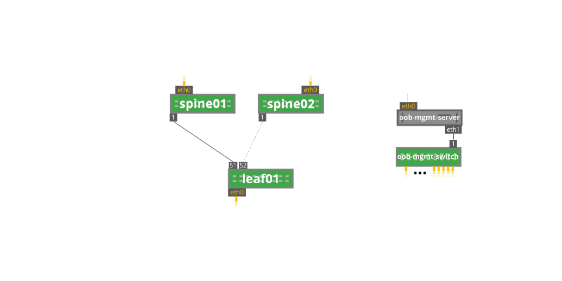

# Automated OSPF Troubleshooting

This shows an example of how to troubleshoot OSPF neighbors.

This uses the [Behave](https://pythonhosted.org/behave/) testing lanuage and python to accomplish this.

The file `validation/steps/ospf.py` has the code that accomplishes this.

As a pre-requisite a topology diagram is required. For this proof of concept I use a static topology diagram within the ospf.py file.

This topology diagram is in the Graph Discription Language [DOT](https://docs.cumulusnetworks.com/display/DOCS/Prescriptive+Topology+Manager+-+PTM)

To use this, the simplest way is to use the [Cumulus Reference Topology](https://github.com/cumulusnetworks/cldemo-vagrant).

On the out of band management server `sudo pip install behave` to load the Behave testing libraries

Clone this project to the oob-mgmt-server
Run `behave validation/ospf.feature` to run the test

The Ansible playbook `main.yml` will reset the configuration of the lab.

The other Ansible playbooks will create faults that show the function of the auotmated troubleshooting.

